```{r setup, include=FALSE}
knitr::opts_chunk$set(echo = TRUE)
```

# 1. Introduction

# 2. Method

## 2.1 Dataset

In this project, we use two sets of data to fit the logistic curves. The first dataset includes cumulative COVID-19 cases from Jan 21 to March 23 in different regions where cases have been confirmed. The second dataset contains similar data points of cumulative cases in the regions from Jan 21 to Apr 27. Both of the datasets were derived by reorganizing the original data sources from https://github.com/CSSEGISandData/COVID-19. By implementing optimization algorithms on the data of a specific region, we obtain the parameters of the logistic curve for that region.

## 2.2 Logistic Curve Model

The function for logisitc curves can be defined as 

$$
f(t)=\frac{K}{1+\exp \{-b(t-c)\}}, \tag{2.1}
$$
where t is the days since the first infection; K is the upper bound; b is growth rate, and c is the mid-point.

With log-transformation, we get

$$
\log\left(\frac{K-N}{N}\right)=a-rt,\tag{2.2}
$$

where $N_t$ is the number of cases at t, $a=bc$, $r=b$. 

For developing logistic curve model for each country data we apply the following two steps:

Step 1: estimate the upper bound

Step 2: fit logistic curve using gradient descent optimization algorithm

### 2.2.1 Upper Bound Estimation

Generally, K is estimated by solving a system of equations

$$
\begin{aligned}
\log \frac{K-N_{1}}{N_{1}}&=a-r t_{1} \\ 
\log \frac{K-N_{2}}{N_{2}}&=a-r t_{2} \\ 
\log \frac{K-N_{3}}{N_{3}}&=a-r t_{3}
\end{aligned}\tag{2.3}
$$

$(t_1, N_1)$, $(t_2, N_2)$ and $(t_3, N_3)$ are the starting point, midpoint and final point in a time sires data respectively. Consequently, we get the formula for K

$$
\hat{K}=\frac{2 N_{1} N_{2} N_{3}-N_{2}^{2}\left(N_{1}+N_{3}\right)}{N_{1} N_{3}-N_{2}^{2}}, \: 2 t_{2}=t_{1}+t_{3}\tag{2.4}
$$

However, $\hat{K}$ could be negtive when $N_2$ is same as or close to $N_1$ , so we also use the properties of gradient at midpoint to estimate K.

When $\Delta t \to 0$, $\frac{dN}{dt} \approx \frac{\Delta N}{\Delta t}$, so we get a estimated midpoint $(t_m,\hat N_m)$ by

$$
\max\left(\frac{N_2-N_1}{t_2-t_1}, \frac{N_3-N_2}{t_3-t_2},...,\frac{N_n-N_{n-1}}{t_n-t_{n-1}}\right).\tag{2.5}
$$
Therefore, estimated K would be

$$
\hat K = 2\hat N_m
$$

### 2.2.2 Optimization

Based on this linear relationship between t and cases in formula (2.2), the loss function that we want to minimize can be defined as

$$
\begin{aligned}
L(t;\hat{a},\hat{r},\hat{K}) &= \frac{1}{2}||y-\hat{a}+\hat{r}t||^2\\
&=\frac{1}{2}||\log\left(\frac{\hat{K}-N_t}{N_t}\right)-\hat{a}+\hat{r}t||^2,
\end{aligned}\tag{2.6}
$$

where $\hat{K}$ is estimated upper bound in formula (2.4). The gradient is

$$
\nabla L(t;\hat{a},\hat{r})=
\left(
\begin{array}{c}
-\sum_{i=1}^n(y_i-\hat{a}+\hat{r}t_i)\\
\sum_{i=1}^nt_i(y_i-\hat{a}+\hat{r}t_i)
\end{array}
\right)\tag{2.7}
$$
Parameters update based on

$$
(\hat a_i,\hat r_i)^T = (\hat a_{i-1},\hat r_{i-1})^T-\alpha\nabla L(t;\hat a_{i-1},\hat r_{i-1})\tag{2.8}
$$
where $\alpha$ is step length.

The gradient descent optimization algorithm’s steps are

Step 1: set starting value $(a,r)^{(0)}$, tolerance $\epsilon$, $i = 1$ and $\alpha = 1$.

Step 2: $L(t;a_{i},r_{i})-L(t;a_{i-1},r_{i-1})\le\epsilon$, quit and solution is $(a,r)^{(i)}$. Otherwise, to step 3.

Step 3: new estimates is updated by formula (2.8), $\alpha = \alpha/2$ and i = i+1. Turn to step 2.

## 2.3 EM ...

# 3. Results

## Obtainded parameters

For most of the regions in the first dataset, since they do not reach the mid-point, the upper bound estimates might be severely biased, resulting in a bad fitted curve. To confirm whether logistic curve is suitable for modeling the spread, we also take the second dataset into account. We finally obtained two sets of parameters(`Parameters_1` for the first dataset and `Parameters_2` for the second) of the model by implementing optimization algorithms on both the first and second dataset(**Figure 1**). The parameters were scaled by taking a natural log. The obtained parameters were then used for clustering later.

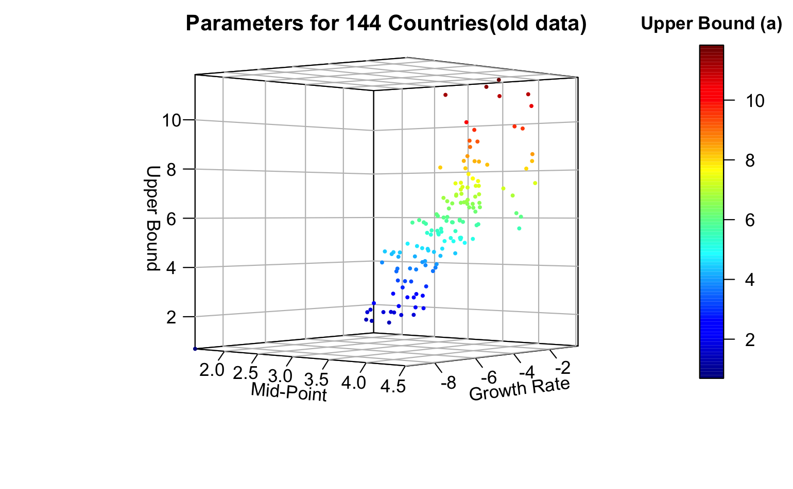{ width=50% }
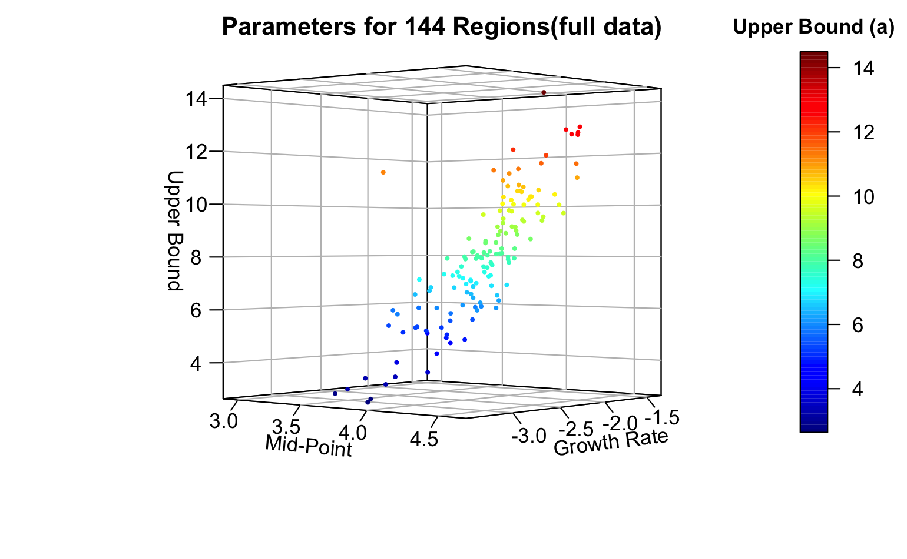{ width=50% }

\centerline{Figure 1 Parameters for 144 regions}

## Results from `Parameters_1`

Initially, we use the first dataset(including cases from Jan 21 to Mar 23) to fit the curves and the second dataset(including cases from Jan 21 to APR 27) to check the predictive ability of the curves. For the first dataset, we assume that whether mid-point occurs or not is closely related to the performance of the curve.

It has been reported that during the early stage of January and Febulary in 2020, there were not many countries(regions) showing a trend that the virus began spreading. In these regions, the number of cases is almost stationary at the beginning and starts increasing 10 or more days after the first case has been confirmed. Obviously, these regions have not reached the mid-point of the spreading. This situation might bring a problem to analysis: The trend for some of the data points for fitting curves are flattened, resulting in a strong bias of upper bound estimates. **Figure 2** shows a series of regions that have the situation mendtioned above. The vertical line in **Figure 2** indicates the cut-off point of dates. We used the points in the left side of the vertical line to fit the curves and the points in the right side to see if the curves predict the future effectively. 


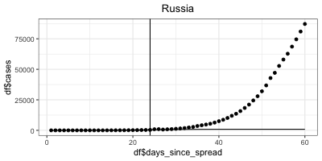{ width=35% }
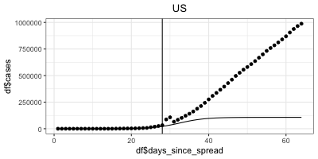{ width=35% }
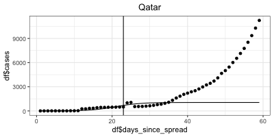{ width=35% }

\centerline{Figure 2 Regions not reaching mid-point}

By checking the data, we found that only China has reached the mid-point within the period given in the first dataset, approching the end of spread. This suggests that the curves for a region will be a perfect fit when that region has reached the mid-point, as shown by the fitted curve for China(**Figure 3**):

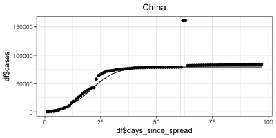

\centerline{Figure 3 Cumulative Cases in China}

There are also some other regions that have extremely irregular cases distribution during the given time point. **Figure 4** shows the examples of such regions. The number of cumulative cases dropped in these regions, which should be impossible. There may be some reasons related to the data collection process.
Under this situation, logistic curve might or might not be an effective good choice for future prediction. While a bad fit to the training set might be due to inadequate data or other reasons, a relatively good training fit might not ensure a correct prediction for the future cases.

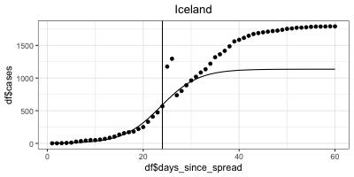{ width=50% }
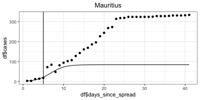{ width=50% } 

\centerline{Figure 4 Regions with irregular cases distribution}

By analyzing the growth rates estimated from the first dataset, we found that the top 8 regions with the highest growth rate are Uzbekistan, Turkey, Montenegro, Togo, Venezuela, Andorra, Mauritius, Holy See. However, as mentioned above, these estimates were highly likely obatined based on a biased upper bound. A more credible growth rates estimation would be based on the second dataset because the many regions in this dataset reached the mid-point. The top 8 regions with the highest growth rate then become Martinique, Montenegro, Turkey, Uzbekistan, Djibouti, US, Russia, Brazil(**Figure 5**).

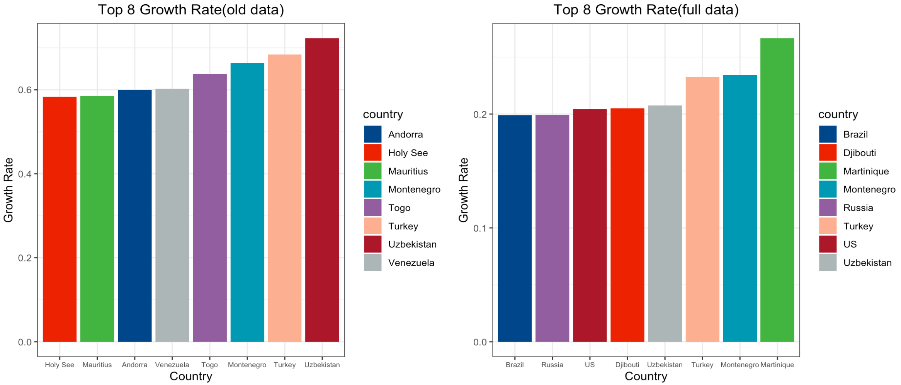

\centerline{Figure 5 Top 8 growth rates}

## Results from `Parameters_2`

By using the second dataset for analysis, we mainly focus on answering if the logistic curve is a reasonable model for fitting the curmulative cases and predicting future new cases. **Figure 6** shows the
curves fitted for the regions in **Figure 1** but from the second dataset. Obviously, the curves fit better as these regions all reached mid-point in the second dataset. This may imply the spread follows a logistic curve. However, based on the results from the two sets of parameters, we may conclude that the performance of the logistic curve heavily depends on the estimation of upper bound. Although several methods have been posted for estimating upper bound, it is still difficult to get the correct answer if the true mid-point does not occur in the data. The occurrence of mid-point is closely related to many other aspects such as policies and population health status.

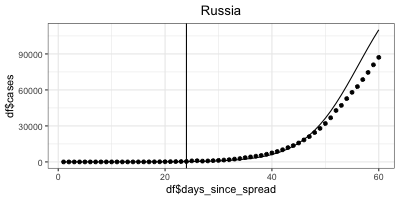{ width=35% }
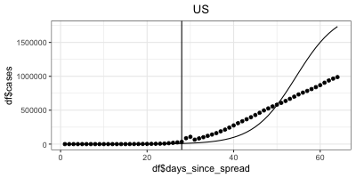{ width=35% }
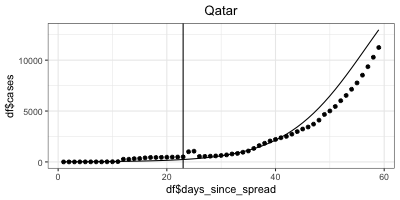{ width=35% }

\centerline{Figure 6 Curves fitted with the full data}


# 4. Conclusions