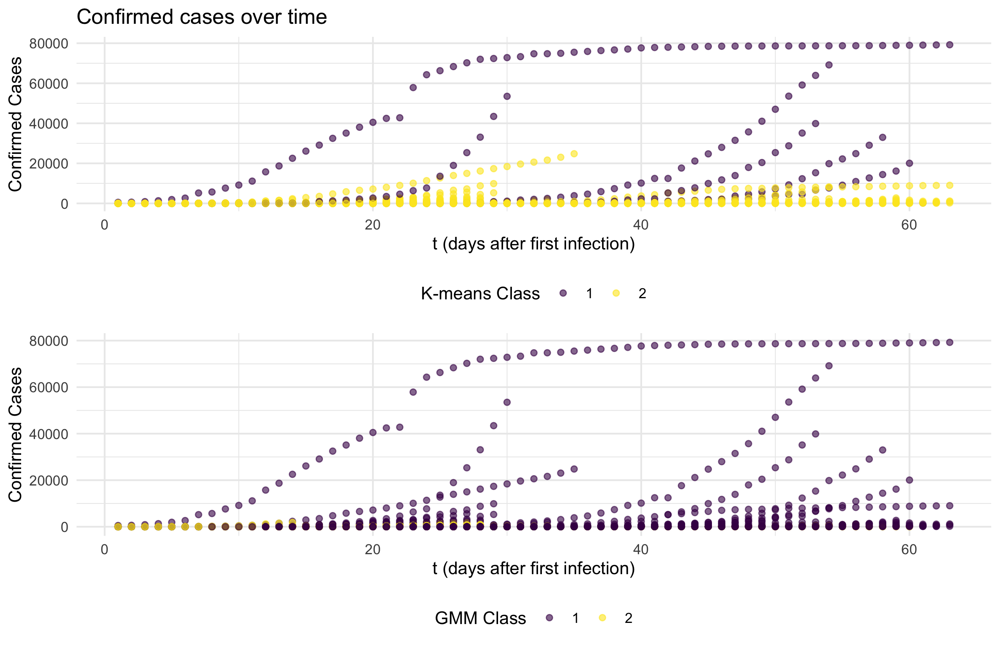

```{r setup, include=FALSE}
knitr::opts_chunk$set(eval = FALSE)
library(tidyverse)
library(ggplot2)
library(MASS)
library(mvtnorm)
library(qrnn)
library(stats)
library(matrixcalc)
library(pracma)
library(ModelMetrics)
library(factoextra)
library(fpc)
library(patchwork)
library(ggmap)
library(janitor)
library(kableExtra)
library(knitr)
library(ggmap)
library(sp)
library(maptools)
library(maps)
library(ggrepel)

knitr::opts_chunk$set(
	echo = TRUE,
	warning = FALSE,
	fig.width = 8, 
  fig.height = 6,
  out.width = "90%"
)

options(
  ggplot2.continuous.colour = "viridis",
  ggplot2.continuous.fill = "viridis"
)

scale_colour_discrete = scale_colour_viridis_d
scale_fill_discrete = scale_fill_viridis_d

theme_set(theme_minimal() + theme(legend.position = "bottom"))
```

# 1. Introduction

The coronavirus pandemic has impacted daily life globally. Using the daily confirmed cases data, we are interested in building a logistic curve model which provides information regards maximum number of cases of a region, the growth rate and the midpoint. In the COVID-19 case,  this maximum limit would be the maximum number of cases a region can reach. The more people who have the virus, the more rapidly it spreads, and the growth will necessarily diminish  when everybody is sick, which make the logistic model a good one to study the spread. With the non-parametric model, we are further interested in finding clusters of fitted curves. This may help us better understand the infection. For instance, whether location or resources of a region or starting time affects spread of the virus more?

# 2. Method

## 2.1 Dataset

In this project, we use two sets of data to fit the logistic curves. The first dataset includes cumulative COVID-19 cases from Jan 21 to March 23 in different regions where cases have been confirmed. The second dataset contains similar data points of cumulative cases in the regions from Jan 21 to Apr 27. Both of the datasets were derived by reorganizing the original data sources from https://github.com/CSSEGISandData/COVID-19. By implementing optimization algorithms on the data of a specific region, we obtain the parameters of the logistic curve for that region.

## 2.2 Logistic Curve Model

The function for logisitc curves can be defined as 

$$
f(t)=\frac{K}{1+\exp \{-b(t-c)\}}, \tag{2.1}
$$
where t is the days since the first infection; K is the upper bound; b is growth rate, and c is the mid-point.

With log-transformation, we get

$$
\log\left(\frac{K-N}{N}\right)=a-rt,\tag{2.2}
$$

where $N_t$ is the number of cases at t, $a=bc$, $r=b$. 

For developing logistic curve model for each country data we apply the following two steps:

Step 1: estimate the upper bound

Step 2: fit logistic curve using gradient descent optimization algorithm

### 2.2.1 Upper Bound Estimation

Generally, K is estimated by solving a system of equations

$$
\begin{aligned}
\log \frac{K-N_{1}}{N_{1}}&=a-r t_{1} \\ 
\log \frac{K-N_{2}}{N_{2}}&=a-r t_{2} \\ 
\log \frac{K-N_{3}}{N_{3}}&=a-r t_{3}
\end{aligned}\tag{2.3}
$$

$(t_1, N_1)$, $(t_2, N_2)$ and $(t_3, N_3)$ are the starting point, midpoint and final point in a time sires data respectively. Consequently, we get the formula for K

$$
\hat{K}=\frac{2 N_{1} N_{2} N_{3}-N_{2}^{2}\left(N_{1}+N_{3}\right)}{N_{1} N_{3}-N_{2}^{2}}, \: 2 t_{2}=t_{1}+t_{3}\tag{2.4}
$$

However, $\hat{K}$ could be negtive when $N_2$ is same as or close to $N_1$ , so we also use the properties of gradient at midpoint to estimate K.

When $\Delta t \to 0$, $\frac{dN}{dt} \approx \frac{\Delta N}{\Delta t}$, so we get a estimated midpoint $(t_m,\hat N_m)$ by

$$
\max\left(\frac{N_2-N_1}{t_2-t_1}, \frac{N_3-N_2}{t_3-t_2},...,\frac{N_n-N_{n-1}}{t_n-t_{n-1}}\right).\tag{2.5}
$$
Therefore, estimated K would be

$$
\hat K = 2\hat N_m
$$

### 2.2.2 Optimization

Based on this linear relationship between t and cases in formula (2.2), the loss function that we want to minimize can be defined as

$$
\begin{aligned}
L(t;\hat{a},\hat{r},\hat{K}) &= \frac{1}{2}||y-\hat{a}+\hat{r}t||^2\\
&=\frac{1}{2}||\log\left(\frac{\hat{K}-N_t}{N_t}\right)-\hat{a}+\hat{r}t||^2,
\end{aligned}\tag{2.6}
$$

where $\hat{K}$ is estimated upper bound in formula (2.4). The gradient is

$$
\nabla L(t;\hat{a},\hat{r})=
\left(
\begin{array}{c}
-\sum_{i=1}^n(y_i-\hat{a}+\hat{r}t_i)\\
\sum_{i=1}^nt_i(y_i-\hat{a}+\hat{r}t_i)
\end{array}
\right)\tag{2.7}
$$
Parameters update based on

$$
(\hat a_i,\hat r_i)^T = (\hat a_{i-1},\hat r_{i-1})^T-\alpha\nabla L(t;\hat a_{i-1},\hat r_{i-1})\tag{2.8}
$$
where $\alpha$ is step length.

The gradient descent optimization algorithm’s steps are

Step 1: set starting value $(a,r)^{(0)}$, tolerance $\epsilon$, $i = 1$ and $\alpha = 1$.

Step 2: $L(t;a_{i},r_{i})-L(t;a_{i-1},r_{i-1})\le\epsilon$, quit and solution is $(a,r)^{(i)}$. Otherwise, to step 3.

Step 3: new estimates is updated by formula (2.8), $\alpha = \alpha/2$ and i = i+1. Turn to step 2.

## 2.3 Clustering

### 2.3.1 Guassian Mixture Model (with EM algorithm)

Cluster analysis or clustering is the task of grouping a set of objects in such a way that objects in the same group (called a cluster) are more similar (in some sense) to each other than to those in other groups (clusters). It is a main task of exploratory data mining, and a common technique for statistical data analysis, used in many fields, including pattern recognition, image analysis, information retrieval, bioinformatics, data compression, computer graphics and machine learning. The probability model-based approach contains Gussian Mixture Method, which assumes that the dataset follows a gussian mixture mixture distributions. (?)

Given that $\{\mathbf x_1,\mathbf x_2,...,\mathbf x_n \} \in \mathbb R^p$ is a collection of $p$ dimensional data points. Assuming the following equation: 

$$x_i\sim
\begin{cases}
N(\boldsymbol \mu_1, \Sigma_1), \mbox{with probability }p_1 \\
N(\boldsymbol \mu_2, \Sigma_2), \mbox{with probability }p_2\\
\quad\quad\vdots\quad\quad,\quad\quad \vdots\\
N(\boldsymbol \mu_k, \Sigma_k), \mbox{with probability }p_k\\
\end{cases}$$

And, 

$$\sum_{j=1}^kp_j =1$$

Let $\mathbf r_i = (r_{i,1},...,r_{i,k})\in \mathbb R^k$  be the cluster indicator of $\mathbf x_i$, which takes form $(0, 0,...,0,1,0,0)$ with $r_{i,j} =I\{ \mathbf x_i\mbox{ belongs to  cluster } j\}$. The cluster indicator $\mathbf r_i$ is a latent variable that cannot be observed. What is complete likelihood of $(\mathbf x_i,\mathbf r_i)$. ???

The distribution of $\mathbf r_i$ follows $$f(\mathbf r_i) = \prod_{j= 1}^k p_j^{r_i,j}$$

The complete log-likelihood is 

$$\ell(\theta; \mathbf x,\mathbf r) = \sum_{i=1}^n \sum_{j=1}^k r_{i,j} [\log p_i + \log  f(\mathbf x_i; \boldsymbol \mu_j, \Sigma_j)] = \sum_{i=1}^n \sum_{j=1}^k r_{i,j} [\log p_i-1/2\log|\Sigma|-1/2 (\mathbf x_i-\boldsymbol \mu_j)^\top\Sigma (\mathbf x_i-\boldsymbol \mu_j)]$$

Evaluate the responsibilities parameter values we got from task 1:

**E-step** 

$$\gamma_{i, k} ^{(t)}= P(r_{i,k}=1 |\mathbf x_i,  \theta^{(t)}) =  
\frac{p_k^{(t)}f(\mathbf x_i|\boldsymbol \mu_k^{(t)}, \Sigma_k^{(t)})}
{\sum_{j=1}^K f(\mathbf x_i|\boldsymbol \mu_j^{(t)}, \Sigma_j^{(t)})}$$

**M-step** 

$\theta^{(t+1)} = \arg\max\ell( \mathbf{x}, \mathbf{\gamma}^{(t)}, \theta )$.

Setting $n_k = \sum_{i=1}^n \gamma_{i, k}$, we can compute:

$$\boldsymbol \mu_k^{(t+1)} = \frac{1}{n_k} \sum_{i=1}^n \gamma_{i, k} \mathbf x_i$$
$$\Sigma_k^{(t+1)} = \frac{1}{n_k} \sum_{i=1}^n \gamma_{i, k} (\mathbf x_i - \boldsymbol \mu_k^{(t+1)})(\mathbf x_i - \boldsymbol \mu_k^{(t+1)})^T$$

$$p_k^{(t+1)} = \frac{n_k}{n}$$

### 2.3.2 K-means

K-means is a special case for Gussian Mixture, where it is not required to consider small variances or the limit case of zero variances. The $K$-means algorithm partitions data into $k$ clusters. In this project, we set $\{\boldsymbol \mu_1, \boldsymbol \mu_2,...,\boldsymbol \mu_k\}$ as the  centers of the $k$ (unknown) clusters, and denote $\mathbf r_i = (r_{i,1},...,r_{i,k})\in \mathbb R^k$ as the ``hard'' cluster assignment of $\mathbf x_i$. 
$k$-means finds cluster centers and cluster assignments that minimize the objective function.
$$J(\mathbf r, \boldsymbol \mu) = \sum_{i=1}^n\sum_{j=1}^kr_{i,j}\|\mathbf x_i-\mu_k\|^2$$

# 3. Results

## Obtainded parameters

For most of the regions in the first dataset, since they do not reach the mid-point, the upper bound estimates might be severely biased, resulting in a bad fitted curve. To confirm whether logistic curve is suitable for modeling the spread, we also take the second dataset into account. We finally obtained two sets of parameters(`Parameters_1` for the first dataset and `Parameters_2` for the second) of the model by implementing optimization algorithms on both the first and second dataset(**Figure 1**). The parameters were scaled by taking a natural log. The obtained parameters were then used for clustering later.

{ width=50% }
{ width=50% }

\centerline{Figure 1 Parameters for 144 regions}

## Results from `Parameters_1`

Initially, we use the first dataset(including cases from Jan 21 to Mar 23) to fit the curves and the second dataset(including cases from Jan 21 to APR 27) to check the predictive ability of the curves. For the first dataset, we assume that whether mid-point occurs or not is closely related to the performance of the curve.

It has been reported that during the early stage of January and Febulary in 2020, there were not many countries(regions) showing a trend that the virus began spreading. In these regions, the number of cases is almost stationary at the beginning and starts increasing 10 or more days after the first case has been confirmed. Obviously, these regions have not reached the mid-point of the spreading. This situation might bring a problem to analysis: The trend for some of the data points for fitting curves are flattened, resulting in a strong bias of upper bound estimates. **Figure 2** shows a series of regions that have the situation mendtioned above. The vertical line in **Figure 2** indicates the cut-off point of dates. We used the points in the left side of the vertical line to fit the curves and the points in the right side to see if the curves predict the future effectively. 


{ width=35% }
{ width=35% }
{ width=35% }

\centerline{Figure 2 Regions not reaching mid-point}

By checking the data, we found that only China has reached the mid-point within the period given in the first dataset, approching the end of spread. This suggests that the curves for a region will be a perfect fit when that region has reached the mid-point, as shown by the fitted curve for China(**Figure 3**):


\centerline{Figure 3 Cumulative Cases in China}

There are also some other regions that have extremely irregular cases distribution during the given time point. **Figure 4** shows the examples of such regions. The number of cumulative cases dropped in these regions, which should be impossible. There may be some reasons related to the data collection process.

Under this situation, logistic curve might or might not be an effective good choice for future prediction. While a bad fit to the training set might be due to inadequate data or other reasons, a relatively good training fit might not ensure a correct prediction for the future cases.

{ width=50% }
{ width=50% } 

\centerline{Figure 4 Regions with irregular cases distribution}

By analyzing the growth rates estimated from the first dataset, we found that the top 8 regions with the highest growth rate are Uzbekistan, Turkey, Montenegro, Togo, Venezuela, Andorra, Mauritius, Holy See. However, as mentioned above, these estimates were highly likely obatined based on a biased upper bound. A more credible growth rates estimation would be based on the second dataset because the many regions in this dataset reached the mid-point. The top 8 regions with the highest growth rate then become Martinique, Montenegro, Turkey, Uzbekistan, Djibouti, US, Russia, Brazil(**Figure 5**).


\centerline{Figure 5 Top 8 growth rates}

## Results from `Parameters_2`

By using the second dataset for analysis, we mainly focus on answering if the logistic curve is a reasonable model for fitting the curmulative cases and predicting future new cases. **Figure 6** shows the
curves fitted for the regions in **Figure 1** but from the second dataset. Obviously, the curves fit better as these regions all reached mid-point in the second dataset. This may imply the spread follows a logistic curve. However, based on the results from the two sets of parameters, we may conclude that the performance of the logistic curve heavily depends on the estimation of upper bound. Although several methods have been posted for estimating upper bound, it is still difficult to get the correct answer if the true mid-point does not occur in the data. The occurrence of mid-point is closely related to many other aspects such as policies and population health status.

{ width=35% }
{ width=35% }
{ width=35% }

\centerline{Figure 6 Curves fitted with the full data}

## Results from clustering

We determined the optimum number of cluster to be 2. There are three methods to choose the number of clusters: The Elbow Method, The Silhouette Method and Gap Statistic Method. In this project, we used Silhouette Method and Gap Statistic Method. Both methods gave an optimum number of 2 for k-means and GMM for parameters regressed from Jan 22 to Mar 24.

2 clusters were tested using k-means and Gaussian mixture algorithm. When using kmeans, 6 countries belonged to cluster one while 138 belonged to cluster two. With Gaussian mixture, the ratio between number of countries in a cluster is 30:114. The 6 countries in cluster one from k-means are included in the 30 countries in cluster one from GMM. From the graph below, we proposed that cluster one in both algorithms correspond to curves with relatively faster spreading speed or with higher upper bound.



\centerline{Figure 7 Clusters shown in Growth Curves}

We calculated MSE for cluster models. The MSE is $5.2*10^6$ for K-means and $6.8*10^6$ for GMM. For COVID-19 data from Jan 22 to Mar 24, we preferred using K-means for clustering.

# 4. Discussion

K-means minimize the distance between sample and the central points in k number of clusters by assigning central points first and optimize them by calculating the distance to them. The clusters in k-means are assumed to be spherical which does not perform well with non-linear data. Instead of hard assignment used in k-means, Gaussian mixture methods adopt probability to determine group membership. The clusters in GMM can take any shape. In this project, we preferred using K-means which probably was due to the high-dimentionality of the data. In addition, other than MSE, we should also consider using BIC to compare the models. BIC offers panelization for complexity.

The clustering is unlikely to be associated with starting time of infection or geographical location. The countries in the cluster that has relatively faster spreading speed range all over the continents with different staring time from late January to early March. On the other hand, these countries are relatively economically advanced with larger population. Crowding may increase the virus speading and those countries are more likely to afford testing and recording confirmed cases. Thus a faster spreading curve can be observed in these countries.

# 5. Conclusion

The simple logistic curve model gave a rough fit of the data with biased upper bound estimate. With more data, we can observe that many countries are reaching the mid-point. We used both k-means and Gaussian mixture model to cluster the data. We found that cluster number of 2 was the optimum and clusters were more likely associated with countries' resources.

# Code

### Task 1: Data Cleaning and Optimization

```{r}
# 1.1 Import & Clean data
####################################################################################
data = read_csv("./covid19-1.csv") %>% janitor::clean_names()
#skimr::skim(data)

#All regions that have cases
data_havecases = data %>%
  group_by(country_region) %>%
  summarise(n_cases = max(confirmed_cases)) %>% #confirmed_cases = cumulative cases
  filter(n_cases != 0)

country = unique(data_havecases$country_region) # select all regions having cases
#regorganize the date variable, for optimization section
data = data %>% 
  mutate(date = str_c(date,"20"), 
         date = as.Date.character(date,
                                  format = "%m/%d/%Y")) %>%
  filter(country_region %in% country) #exclude regions that have no case


#############################################################
# define a function that returns a list, containing the information of a specific region needed for optimization
date_to_day = function(df,country_name){
  df_country = df %>%
    filter(country_region == country_name) %>% #select this region
    group_by(date) %>% 
    summarise(cases = sum(confirmed_cases)) %>% # calculate cumulative cases
    arrange(date) #arrange by date
  
  start_day = which(df_country$cases!=0)[1] # first row that the first case occurs
  start_date = df_country$date[start_day] # first date
  df_country = df_country[start_day:nrow(df_country),] %>%
    mutate(days_since_spread = c(1:nrow(.))) # create days since spread, numeric var
  
  return(list(start_date = start_date,
              df_country = df_country,
              country.name = country_name))  
} # returns spread date & cases from that date & region's name（use df_country as the data to optimize）
#############################################################


# example for extracting a region's information
#t = date_to_day(data,"Portugal")
#t$start_date
#t$df_country
#t$country.name

# print 10 regions data
#for (region in country[1:10]) {
#  res = date_to_day(data,region)
#  print(res$df_country)
#}

# simple plot
#plot(t$df_country$days_since_spread,t$df_country$cases)
####################################################################################
```

```{r}
# 1.2 preparation for optimization
# define prerequsite functions for optimization
####################################################################################
# log.curve
#define a general logistic growth curve
log.curve = function(para,t){
  a = para[1]
  b = para[2]
  c = para[3]
  return(a/(1+exp(-b*(t - c))))
}

# define a function for calculating delta(difference of cases b/w T_i T_i+1)
delta = function(x){
  r = NULL
  for (i in 2:length(x)) {
    r[i-1] = x[i] - x[i-1]
  }
  return(r)
}

# define a function to check delta: if the original data contains 4 or more days of # of cases not increasing, then it returns true.
check_delta = function(delta){
  if(sum(min(delta[1:3])) == 0){
    return(TRUE) #as.integer((2/5)*length(delta))
  }else{
    return(FALSE)
  }
}

#Tranformation: a <= k, bc <= a, b <= r(abc on left hand side correspond to the formula given by the project instruction)
#To estimate K firstly, when the original data contains many days of # of cases not increasing, we use 3-point method, otherwise use the turning-point method.
k.estimate = function(df){ # para = c(k,a,r)
  cases = df$cases
  n1 = cases[1]
  n2 = cases[as.integer(median(1:length(cases)))] #2 * t2 = t3?
  n3 = cases[length(cases)]
  #print(c(n1,n2,n3))
  delta = delta(cases)
  #print(delta)
  if(check_delta(delta) == FALSE & ((2*n1*n2*n3)-n2^2*(n1+n3))/(n1*n3-n2^2) > 0){
    return(((2*n1*n2*n3)-n2^2*(n1+n3))/(n1*n3-n2^2))
  }
    #vec = NULL
    ##if(n3 == max(cases)){return(2*n3)}
    ##else{
    #for (i in 2:length(cases)) {
    #  vec[i-1] = cases[i] - cases[i-1]
    #}
    if(cases[which.max(delta)+1] != max(cases) && abs(cases[which.max(delta)+1] - max(cases)) > (1/7) * cases[which.max(delta)+1]){
      return(2*max(cases))
    }else{
    return(2*cases[which.max(delta)+1])
      }#+2??
  }

#define a function for calculating y based on estimated k
y.real = function(df){
  N = df$cases
  k = rep(k.estimate(df), length(N))
  for (i in 1:length(k)) {
    if (k[i] == N[i]) {
      k[i] = k[i] + 0.5
    }
  }
  trans = (k - N)/N
  y.real = NULL
  
  for (each in trans) {
    if (each > 0){
      each = log(each)
      y.real = append(y.real,each)
    }else{
      each = 1/2 * log(each^2)
      y.real = append(y.real,each)
    }
  }
  return(y.real)
}

#define a function for calculating y.hat
y.hat = function(df,para){ # c(a,r)
  a = para[1]
  r = para[2]
  t = df$days_since_spread
  return(a - r*t)
}


# loss function
loss = function(y.real,y.hat,para){
  return((1/length(y.real)) * sum((y.real - y.hat)^2))
}

# gradient
gradient = function(para,y.real,y.hat){ #para = c(a,r)
  grad_a = (-2/length(y.real)) * sum(y.real - y.hat)
  grad_r = (-2/length(y.real)) * sum((y.real - y.hat)*-c(1:length(y.real))) # pass
  return(c(grad_a,grad_r)) # return gradients
}


#define a function to check data: see if the original data contains many days of # of cases not increasing
check_df = function(df){
  if(sum(df$cases == min(df$cases))>=10|sum(df$cases == min(df$cases)+1)>=10|sum(df$cases == min(df$cases)+2) >= 10){
    return(TRUE) #垃圾数据，需要裁剪
  }else{
    return(FALSE)
  }
}

# define a function to check the data distribution first and then determine whether the data should be sliced before the data is used for optimization.
df.modifier = function(df){
  if(check_df(df) == TRUE){
    if(sum(df$cases == min(df$cases))>=10){
      s = sum(df$cases == min(df$cases))
      slicing_index = s - 3
      df = df %>% .[-c(1:slicing_index),] %>% mutate(days_since_spread = 1:nrow(.))
    #change days
      return(df)
    }else{
        return(df)
      }
    #if(sum(df$cases == min(df$cases)+1)>=10){s = sum(df$cases == min(df$cases))+1}
    #if(sum(df$cases == min(df$cases)+2)>=10){s = sum(df$cases == min(df$cases))+2}
  }else{
    return(df)
  }
}
```

```{r}
# 1.3 Optimization

#An optimizer for a,r; using gradient descent; return a,b,c,loss,iter
optimizer = function(para, df, tol = 1e-10, maxiter = 20000){
  k = k.estimate(df)
  y.real = y.real(df)
  y.hat = y.hat(df,para)
  
  loss_prev = -Inf
  loss_cur = loss(y.real,y.hat,para) # loss
  para_cur = para
  iter = 1
  res = data.frame(a = para_cur[1], r = para_cur[2], loss = loss_cur,iter = iter)
  
  while (abs(loss_cur - loss_prev) > tol && iter < maxiter) {
    iter = iter + 1
    #print(iter)
    step = 1
    #print(para_cur)
    loss_prev = loss_cur
    para_prev = para_cur
    
    grad = gradient(para_prev, y.real = y.real, y.hat = y.hat)
    
    #print(grad)
    
    para_cur = para_prev - step * grad # update parameters
    
    #print(para_cur)
    
    y.hat = y.hat(df,para_cur) #new y.hat
    #print(y.hat)
    
    loss_cur = loss(y.real = y.real, y.hat = y.hat,para_cur)#new loss
    
    #print(paste("loss_cur > loss_pre:", loss_cur > loss_prev))
    #print(loss_cur)
    while (loss_cur > loss_prev) {
      step = 0.5 * step
      para_cur = para_prev - step * grad
      y.hat = y.hat(df,para_cur)
      loss_cur = loss(y.real = y.real, y.hat = y.hat,para_cur)
    }
    
    res_tmp  = data.frame(a = para_cur[1], r = para_cur[2], loss = loss_cur,iter = iter)
    res = rbind(res,res_tmp)
    
  }
  res = res %>% mutate(k = k,b = r,c = a/r) %>% select(loss,k,b,c,iter) %>% rename("a" = "k")
  return(res)
}
####################################################################################
```

```{r}
# 1.4 get data & parameters
# obtain parameters
####################################################################################
##obtain parameters for a specific region
country #all available regions
obtain_para = function(country){
  t = date_to_day(data,country)
  df = df.modifier(t$df_country)
  para = c(1,4) # initial values for a,r
  
  para.data = optimizer(para,df) 
  para.final = para.data[nrow(para.data),c(2:4)] %>% as.numeric() #final result
  pred = log.curve(para = para.final, t = 1:nrow(df))
  return(list(para = para.final, pred = pred, time = 1:nrow(df), turncated.df = df))
}
####################################################################################
```

```{r}
#importing data after 3.23
path = './csse_covid_19_data/csse_covid_19_daily_reports'
files.csv = list.files(path)
files.csv = files.csv[63:length(files.csv)-1]

read.data = function(file_list){
  data = data.frame()
  for (file in file_list){
    #print(str_sub(file,end = 5))
    df = read_csv(str_c(path,"/",file)) %>% dplyr::select(Country_Region,Province_State,Confirmed) %>% mutate(date = str_sub(file,end = 5))
    data = rbind(data,df)
  }
  return(data)
}

#uniform the data format
datanew = read.data(files.csv) %>% mutate(date = str_c("2020-",date),
                                          date = as.Date(date)) %>%
  rename("Confirmed_cases" = "Confirmed") %>% janitor::clean_names() %>%
  mutate(usage = "predict")

#list with 144 regions
country = data.parameters$country

# calculate cumulative cases
datanew = datanew %>%
  filter(country_region %in% country)

# import old data
dataold = read_csv('./dataold.csv') %>%
  mutate(usage = "fitted") %>%
  select(names(datanew))

# combine new and old data, dont need to save(already included in the branch)
data.combined = rbind(dataold,datanew)
#write.csv(data.combined,"data.combined.csv")

```

```{r}
# 1.5 obtain all parameters 
# (a,b,c) for all countries
####################################################################################
para.all = function(country){
  para.all = data.frame()
  for (country.each in country) {
    
    a = obtain_para(country.each)$para[1]
    b = obtain_para(country.each)$para[2]
    c = obtain_para(country.each)$para[3]
    country.name = country.each
    para.all = rbind(para.all, data.frame(a = a, b = b, c = c, country = country.name))
    print(paste(country.each," done!"))
  }
  return(para.all)
}
####################################################################################

##############fit model with data before 3.23############################################
#df = date_to_day(data,"Saint Vincent and the Grenadines")$df_country
#df$cases
#df = df.modifier(df)
#k.estimate(df)

country = country[-113] #"Saint Vincent and the Grenadines" deleted(all 1's)
parameters = para.all(country)
#write.csv(parameters,"./parameters_0428_old.csv")


###############fit model with data after 3.23###########################################
##dont clear working space
data = read_csv("./data.combined.csv") # import new data
country = country[-113] #"Saint Vincent and the Grenadines" deleted(all 1's)
parameters = para.all(country)
#write.csv(parameters,"./parameters_0428_new.csv")
#############fit model with data after 3.23############################################
```

### Task 2: Clustering

```{r}
## read in parameters
res = read.csv("parameters.csv") %>% 
  dplyr::select(-X) %>% 
  mutate(
    a = round(a,0),
    b = round(b,3),
    c = round(c,0)
  ) 
region_index = as.character(unique(res$country))
df_list = vector("list", length = length(region_index))

all_t=NULL
for(c in 1:length(df_list))
all_t = rbind(all_t, df_list[[c]][nrow(df_list[[c]]), 3])
sum((res[,3])<all_t[,1]) # total country pass the mid point
names = res[which((res[,3]) < all_t[,1]), 4]# names of those country
```

```{r}
## Gaussian Mixture using EM algorithm
# data = covid_test, cluster_n = cluster number
EM = function(data, cluster_n){
  data = as.matrix(data) %>% scale()
  n = nrow(data)
  q = ncol(data)
  p_j = rep(1/cluster_n, cluster_n)
  mu = data[sample(n, cluster_n), ] %>% as.matrix()
  covmat = diag(ncol(data))
  covlist = list()
  for(i in 1:cluster_n){
    covlist[[i]] = covmat
  }
count = 1
while(count < 100){     
  mu_new = mu
  
  # E-step: Evaluate posterior probability, set as gamma     
  gamma = c()     
  for(j in 1:cluster_n){       
    gamma2 = apply(data,1, dmvnorm, mean = mu[j,], sigma = covlist[[j]])       
    gamma = cbind(gamma, gamma2)     
  }
    
  # M- step: Calculate mu     
  tempmat = matrix(rep(p_j, n), nrow = n,byrow = T)     
  r = (gamma * tempmat) / rowSums(gamma * tempmat)     
  mu = t(r) %*% data / colSums(r)
  
  # M- step: Calculate Sigma and p     
  for(j in 1:cluster_n){       
    sigma = matrix(rep(0, q^2), ncol = q)       
    for(i in 1:n){         
      sigma = sigma + r[i,j] * (data[i,] - mu_new[j,]) %*% t(data[i,] - mu_new[j,])       
      }       
    covlist[[j]] = sigma/sum(r[,j])     
    }    
  p_j = colSums(r)/n    
  count = count + 1  
  }
  
  cluster = which(r == apply(r, 1, max), arr.ind = T)   
  cluster = cluster[order(cluster[, 1]), ] 
  
  # return mu, covlist, p and cluster
  return(list(mu = mu, 
              covlist = covlist, 
              p_j = p_j, 
              cluster = cluster)) 
}

```


```{r}
em_dat = res %>% 
  dplyr::select(-country) 

## res for dat
set.seed(666)
res2 = EM(em_dat,2)
res3 = res2$mu %>% 
  as.data.frame()
res3

# clusters
set.seed(666)
clusters = kmeans(em_dat, 2)
clusternumbers = as.factor(clusters$cluster)

# est_mean
a_mean = mean(res$a)
a_sd = sd(res$a)
b_mean = mean(res$b)
b_sd = sd(res$b)
c_mean = mean(res$c)
c_sd = sd(res$c)
em_mean = res3 %>% 
  mutate(
    a = a*a_sd+a_mean,
    b = b*b_sd+b_mean,
    c = c*c_sd+c_mean,
  ) 

a_mean
b_mean
c_mean
em_mean
```

```{r}
# res4 is the classification result of em and kmeans
res4 = res2$cluster %>% 
  as.data.frame() %>% 
  dplyr::select(-1) %>% 
  mutate(country = region_index ) %>% 
  dplyr::select(2,1) %>% 
  rename(em_class = col) %>% 
  mutate(
    kmeans_class = clusters$cluster
  )


kmean_mean = clusters$centers %>% 
  as.data.frame()

mean_value = rbind(em_mean,kmean_mean) %>% 
  mutate(method = c("em","em","kmeans","kmeans")) %>% 
  dplyr::select(c(4,1,2,3))


mean_value_1 = rbind(mean_value[1,], mean_value[3,])
mean_value_1
mean_value_2 = rbind(mean_value[2,], mean_value[4,])
mean_value_2
```

```{r}
res5 = res4 %>%
  mutate(em_a = ifelse(em_class == 1, mean_value[1,2], mean_value[2,2]),
         em_b = ifelse(em_class == 1, mean_value[1,3], mean_value[2,3]),
         em_c = ifelse(em_class == 1, mean_value[1,4], mean_value[2,4]),
         kmean_a = ifelse(kmeans_class == 1, mean_value[3,2], mean_value[4,2]),
         kmean_b = ifelse(kmeans_class == 1, mean_value[3,3], mean_value[4,3]),
         kmean_c = ifelse(kmeans_class == 1, mean_value[3,4], mean_value[4,4]))


final = cbind(res5, res[,1:3] ) %>% 
  mutate(a_em_error = abs(em_a-a)^2,
         a_kmeans_error = abs(kmean_a-a)^2,
         b_em_error = abs(em_b-b)^2,
         b_kmeans_error = abs(kmean_b-b)^2,
         c_em_error = abs(em_c-c)^2,
         c_kmeans_error = abs(kmean_c-c)^2)


error = final %>% 
  mutate(em_error = sqrt(a_em_error + b_em_error + c_em_error),
         kmeans_error = sqrt(a_kmeans_error + b_kmeans_error + c_kmeans_error))
em_error = sum(error$em_error)
em_error
kmeans_error = sum(error$kmeans_error)
kmeans_error
```

```{r}
raw = read.csv("covid19-1.csv") %>% janitor::clean_names()

raw$date2 <- mdy(raw$date)
raw$start <- as.Date("2020-01-21")

raw = raw %>% 
  mutate(t = date2 - start)

data = raw %>% 
  group_by(country_region, 
           date2, t) %>% 
  summarise(concases = sum(confirmed_cases)) %>% 
  ungroup()

data = data %>% filter(!concases == 0)

data %>%
  ggplot(aes(x = date2, y = concases)) +
  geom_point(aes(color = country_region)) +
  theme(legend.position = "none")

cont = data %>% 
  group_by(country_region) %>% 
  summarise(cont = n())

data = left_join(data, cont, by = "country_region")

covid = data %>% mutate(t = t - (max(t) - cont)) %>% 
  mutate(t = as.numeric(t),
         country = country_region) %>% 
  dplyr::select(-cont, -country_region)


membership = left_join(covid, final, by = "country")

covid %>% distinct(country_region)
membership %>% distinct(country)

membership %>% drop_na()

em_1 = membership %>% filter(em_class == 1) %>% distinct(country)
em_1
membership %>% drop_na() %>%
  ggplot(aes(x = t, y = concases)) +
  geom_point(aes(color = factor(em_class)))

membership %>% filter(kmeans_class == 1) %>% distinct(country)
membership %>% drop_na() %>%
  ggplot(aes(x = t, y = concases)) +
  geom_point(aes(color = factor(kmeans_class)))
```

```{r}
## finding optimal cluster number
em_dat_scaled <- scale(em_dat)
## use silhouette
fviz_nbclust(em_dat_scaled, kmeans, method = "silhouette",k.max=15)
## use Gap Statistic Method
library(cluster)
set.seed(123)
gap_stat <- clusGap(em_dat_scaled, FUN = kmeans, nstart = 25,
                    K.max = 10, B = 50)
fviz_gap_stat(gap_stat)
```


